# free5GC-multi-cluster-deployment
# Deploying free5GC Across Three MicroK8s Clusters


[](https://kubernetes.io/)
[](https://microk8s.io/)
[](https://helm.sh/)
[](https://www.free5gc.org/)

---

## 📋 Table of Contents

- [Overview](#overview)
- [Architecture](#architecture)
  - [Three-Cluster Design](#three-cluster-design)
  - [Why Three Clusters](#why-three-clusters)
- [Prerequisites](#prerequisites)
  - [Hardware/VM Requirements](#hardwarevm-requirements)
- [Network Design](#network-design)
  - [IP Addressing Scheme](#ip-addressing-scheme)
- [Installation](#installation)
  - [MicroK8s Setup](#microk8s-setup)
  - [Multus CNI Configuration](#multus-cni-configuration)
  - [Control Plane Deployment](#control-plane-deployment)
  - [User Plane Deployment](#user-plane-deployment)
  - [RAN Simulation UERANSIM](#ran-simulation-ueransim)
- [Testing & Validation](#testing--validation)
  - [Protocol Flow Overview](#protocol-flow-overview)
  - [Control Plane Logs](#control-plane-logs)
  - [RAN Simulation Logs](#ran-simulation-logs)
  - [User Plane Connectivity Test](#user-plane-connectivity-test)
- [Advanced Use Cases](#advanced-use-cases)
  - [SOCKS5 Sidecar Proxy Pattern](#socks5-sidecar-proxy-pattern)
  - [Ubuntu Desktop with VNC](#ubuntu-desktop-with-vnc)
  - [Speed Test via 5G Network](#speed-test-via-5g-network)
- [Lessons Learned](#lessons-learned)
  - [Kubernetes Patterns Mastery](#kubernetes-patterns-mastery)
  - [Networking Deep Dive](#networking-deep-dive)
  - [Operational Challenges](#operational-challenges)
  - [The Telecom Reality](#the-telecom-reality)
- [Next Steps](#next-steps)
  - [Phase 1 GitOps & CI/CD](#phase-1-gitops--cicd--in-progress)
  - [Phase 2 True Cloud-Native Networking](#phase-2-true-cloud-native-networking--planned)
- [Resources](#resources)
  - [Official Documentation](#official-documentation)
  - [3GPP Specifications](#3gpp-specifications)
  - [Related Projects](#related-projects)
  - [Community & Support](#community--support)
- [License](#license)
- [Contributing](#contributing)
- [Acknowledgments](#acknowledgments)
- [Contact](#contact)

---

## Overview

This project demonstrates the deployment of **free5GC**, an open-source 5G Core Network, across **three independent MicroK8s clusters**. Unlike typical Kubernetes tutorials, this deployment tackles real-world telecom challenges:

- 🔌 **Multiple network interfaces per pod** (N2, N3, N4, N6)
- 🌐 **Direct Layer 2 connectivity** using MACVLAN
- 🏗️ **Multi-cluster architecture** mirroring production 5G deployments
- 📡 **Complex protocol stacks** (NGAP, PFCP, GTP-U)

### 5G core architecture

The evolution from 4G EPC to 5G Core represents a fundamental shift from monolithic VNFs to cloud-native microservices. 

```mermaid
---
config:
  theme: dark
  look: neo
  layout: fixed
---
flowchart LR
 subgraph ACCESS["(RAN)"]
    direction TB
        UE["UE  📱"]
        gNB["gNB  🗼"]
  end
 subgraph CORE_CTRL["5GC Control Plane  (free5GC NFs)"]
    direction TB
        AMF["AMF  🧭  <br>(Access Mobility function)"]
        SMF["SMF ⚙️ <br>(Session Mgmt)"]
        AUSF["AUSF 🔐  <br>(Authentication)"]
        UDM["UDM authentication🔑  <br>(Subscriber Data)"]
        UDR["UDR 🚀 <br>(User Data Repository)"]
        PCF["PCF⚖️  <br>(Policy Control)"]
        NSSF["NSSF 📊 <br>(Slice Selection)"]
        NRF["NRF exposure🔍 <br>(NF Registry/Discovery)"]
  end
 subgraph USER_PLANE["User Plane"]
    direction TB
        UPF["UPF 🚀 <br>(User Plane)"]
  end
 subgraph DATA_NET["Data Network"]
    direction TB
        DN["DN / Internet 🌐"]
  end
    gNB -- "N2 (NG-C) NGAP" --> AMF
    gNB -- "N3 (GTP-U)" --> UPF
    AMF -- N11 --> SMF
    SMF -- N4 (PFCP) --> UPF
    UPF -- N6 --> DN
    AMF -- N12 --> AUSF
    AMF -- N13 --> UDM
    AUSF -- N8 ---> UDM
    UDM --- UDR
    SMF -- N7 --> PCF
    AMF -- N22 --> NSSF
    AMF -. SBI (Register/Discover) .-> NRF
    SMF -. SBI (Register/Discover) .-> NRF
    AUSF -. SBI .-> NRF
    UDM -. SBI .-> NRF
    PCF -. SBI .-> NRF
    NSSF -. SBI .-> NRF
    UE -- Radio (NR) --> gNB
    UE -- N1 (NAS) --> AMF
     UE:::radio
     gNB:::radio
     AMF:::box
     SMF:::box
     AUSF:::box
     UDM:::box
     UDR:::box
     PCF:::box
     NSSF:::box
     NRF:::box
     UPF:::upf
     DN:::dn
    classDef domain fill:#0d1b2a,stroke:#0d1b2a,color:#fff,stroke-width:0px
    classDef box fill:#e6f0ff,stroke:#2c5282,stroke-width:1px,color:#122
    classDef upf fill:#fff5e6,stroke:#b7791f,stroke-width:1px,color:#241e0f
    classDef dn fill:#e6fffa,stroke:#2c7a7b,stroke-width:1px,color:#123
    classDef radio fill:#f0fff4,stroke:#2f855a,stroke-width:1px,color:#123
    classDef sbi stroke-dasharray: 3 3
```



  *5G Core Network Functions and 3GPP Interfaces*

---

## Architecture

### Three-Cluster Design


| Cluster | Role | Components |
|---------|------|------------|
| **Cluster 1** | RAN Simulation | UERANSIM (gNB + UE) |
| **Cluster 2** | Control Plane | AMF, SMF, NRF, UDM, UDR, AUSF, PCF, NSSF, MongoDB |
| **Cluster 3** | User Plane | UPF (User Plane Function) |

### Why Three Clusters

✅ **Separation of Concerns** - Distinct responsibilities per cluster  
✅ **Failure Domain Isolation** - Crashes don't cascade  
✅ **Independent Scaling** - Control and user planes scale differently  
✅ **Network Realism** - Mirrors geographic distribution in production  
✅ **Learning Value** - Master multi-cluster networking patterns


*Physical cluster deployment on EVE-NG*

---

## Prerequisites

### Hardware/VM Requirements

| VM | vCPUs | RAM | Disk | OS |
|----|-------|-----|------|-----|
| VM1 (UERANSIM) | 2 | 4GB | 20GB | Ubuntu 20.04 |
| VM2 (Control Plane) | 4 | 8GB | 40GB | Ubuntu 20.04 |
| VM3 (UPF) | 2 | 4GB | 20GB | Ubuntu 20.04 |


## Network Design

### IP Addressing Scheme

| VM | Interface | Function | Subnet | Assigned IP | Notes |
|----|-----------|----------|--------|-------------|-------|
| **VM1 (UERANSIM)** | eth2 | N2 (gNB ↔ AMF) | 10.100.50.248/29 | 10.100.50.250 | NGAP/SCTP |
| | eth1 | N3 (gNB ↔ UPF) | 10.100.50.232/29 | 10.100.50.236 | GTP-U tunnel |
| **VM2 (Control Plane)** | eth2 | N2 (AMF) | 10.100.50.248/29 | 10.100.50.249 | AMF N2 interface |
| | eth1 | N4 (SMF ↔ UPF) | 10.100.50.240/29 | 10.100.50.244 | PFCP control |
| **VM3 (UPF)** | eth3 | N3 (UPF ↔ gNB) | 10.100.50.232/29 | 10.100.50.233 | GTP-U endpoint |
| | eth1 | N4 (UPF ↔ SMF) | 10.100.50.240/29 | 10.100.50.241 | PFCP interface |
| | eth2 | N6 (Data Network) | 10.0.137.0/24 | DHCP | Internet egress |
```mermaid
[Network topology diagram - to be added]
```

---

## Installation

### MicroK8s Setup

Run on **all three VMs**:
```bash
# Update system
sudo apt update && sudo apt upgrade -y

# Install dependencies
sudo apt install -y curl git net-tools iputils-ping

# Install MicroK8s
sudo snap install microk8s --classic

# Configure user permissions
sudo usermod -a -G microk8s $USER
sudo chown -f -R $USER ~/.kube
newgrp microk8s

# Enable essential add-ons
microk8s enable dns helm3

# Enable Multus CNI
microk8s enable community
microk8s enable multus

# Create aliases
alias kubectl='microk8s kubectl'
alias helm='microk8s helm3'
```

**Verify Installation:**
```bash
microk8s status
kubectl get nodes
```


*Successful MicroK8s installation*

---

### Multus CNI Configuration

#### Understanding Multus Architecture

Multus acts as a **meta-plugin**, allowing pods to attach multiple network interfaces by chaining CNI plugins.
```mermaid
[Multus architecture diagram showing pod → CNI layer → host network - to be added]
```

#### Enable Promiscuous Mode

MACVLAN requires promiscuous mode on host interfaces:
```bash
sudo tee /etc/systemd/system/promisc-ifaces.service <<EOF
[Unit]
Description=Enable promiscuous mode on eth1 and eth2
After=network.target

[Service]
Type=oneshot
ExecStart=/sbin/ip link set eth1 promisc on
ExecStart=/sbin/ip link set eth2 promisc on
RemainAfterExit=yes

[Install]
WantedBy=multi-user.target
EOF

sudo systemctl daemon-reload
sudo systemctl enable promisc-ifaces
sudo systemctl start promisc-ifaces
systemctl status promisc-ifaces
```


*Systemd service ensuring promiscuous mode persistence*

#### NetworkAttachmentDefinitions NADs

Example NAD for UPF:
```yaml
# See config files in repository
```


*UPF NetworkAttachmentDefinition showing N3 and N4 interfaces*

---

### Control Plane Deployment

Deploy on **VM2 (Control Plane cluster)**:
```bash
# Add towards5gs Helm repository
helm repo add towards5gs https://raw.githubusercontent.com/Orange-OpenSource/towards5gs-helm/main/repo/
helm repo update

# Install free5GC control plane
helm install free5gc towards5gs/free5gc \
  --namespace free5gc \
  --create-namespace \
  --values control-plane-values.yaml
```

#### Access WebUI

Navigate to: `http://<CONTROL_PLANE_IP>:30500`

**Default Credentials:**
- Username: `admin`
- Password: `free5gc`


*WebUI for subscriber provisioning*

#### Verify Deployment
```bash
kubectl get pods -n free5gc
kubectl get svc -n free5gc
```


*All control plane network functions running*

---

### User Plane Deployment

Deploy on **VM3 (UPF cluster)**:

#### Install gtp5g Kernel Module
```bash
git clone https://github.com/free5gc/gtp5g.git
cd gtp5g
sudo apt install -y gcc g++ cmake autoconf libtool pkg-config libmnl-dev libyaml-dev
make clean && make
sudo make install

# Verify installation
lsmod | grep gtp5g
```

#### Deploy UPF via Helm
```bash
helm install free5gc-upf towards5gs/free5gc-upf \
  --namespace free5gc \
  --create-namespace \
  --values upf-values.yaml
```

#### Critical Enable IP Forwarding

Add to `upf-values.yaml`:
```yaml
podSecurityContext:
  sysctls:
    - name: net.ipv4.ip_forward
      value: "1"
securityContext:
  privileged: true
  capabilities:
    add: 
      - NET_ADMIN
```


*UPF pod with multiple network interfaces*

---

### RAN Simulation UERANSIM

Deploy on **VM1 (UERANSIM cluster)**:
```bash
helm install ueransim towards5gs/ueransim \
  --namespace ueran \
  --create-namespace \
  --values ueransim-values.yaml
```

UERANSIM simulates:
- **gNodeB** (N2/N3 interfaces)
- **UE** (User Equipment with registration and session establishment)


*gNB and UE pods running*

---

## Testing & Validation

### Protocol Flow Overview

Understanding the 5G protocol stack is crucial for debugging:
```mermaid
[Protocol sequence diagram: UE → gNB → AMF → SMF → UPF → Internet - to be added]
```

### Key Protocols

| Protocol | Interface | Purpose |
|----------|-----------|---------|
| **NAS** | N1 (UE ↔ AMF) | Authentication, mobility management |
| **NGAP** | N2 (gNB ↔ AMF) | Control plane signaling over SCTP |
| **PFCP** | N4 (SMF ↔ UPF) | User plane session control |
| **GTP-U** | N3 (gNB ↔ UPF) | User data tunneling |

### Control Plane Logs

#### AMF Logs
```bash
kubectl logs -n free5gc <amf-pod-name> --tail=50
```


*AMF successfully handling UE registration*

**Key Log Entries:**
- ✅ SCTP connection from gNB established
- ✅ NG Setup Request/Response successful
- ✅ UE authentication completed
- ✅ Registration Accept sent

#### SMF Logs
```bash
kubectl logs -n free5gc <smf-pod-name> --tail=50
```


*SMF creating PDU session and selecting UPF*

**Key Log Entries:**
- ✅ Create SM Context Request received
- ✅ UPF selected (10.100.50.241)
- ✅ PFCP Session Establishment successful
- ✅ UE IP allocated (10.60.0.1)

#### UPF Logs
```bash
kubectl logs -n free5gc <upf-pod-name> --tail=50
```


*UPF establishing GTP-U tunnel*

**Key Log Entries:**
- ✅ PFCP Association with SMF established
- ✅ GTP-U tunnel created (TEID assigned)
- ✅ Forwarding rules installed

### RAN Simulation Logs

#### UE Logs
```bash
kubectl logs -n ueran <ue-pod-name> --tail=50
```


*UE registration and PDU session establishment*

#### gNB Logs
```bash
kubectl logs -n ueran <gnb-pod-name> --tail=50
```


*gNB connecting to AMF and establishing N3 tunnel*

### User Plane Connectivity Test

#### Ping via uesimtun0
```bash
kubectl exec -it -n ueran <ue-pod-name> -- bash
ping -I uesimtun0 8.8.8.8
```


*Successful ping through 5G network*

#### Verify GTP-U Traffic

Monitor UPF GTP interface:
```bash
kubectl exec -it -n free5gc <upf-pod-name> -- bash
watch -n 1 'ip -s link show upfgtp'
```


*RX/TX counters incrementing, confirming tunnel traffic*

---

## Advanced Use Cases

### SOCKS5 Sidecar Proxy Pattern

This demonstrates how to route external client traffic through the 5G network using a sidecar container.
```mermaid
[Sidecar pattern diagram - to be added]
```

#### Patch UE Pod with SOCKS5 Proxy
```bash
kubectl patch deployment ueran-ueransim-ue -n ueran --type='json' -p='[
  {
    "op": "add",
    "path": "/spec/template/spec/containers/-",
    "value": {
      "name": "socks-proxy",
      "image": "serjs/go-socks5-proxy:latest",
      "ports": [{"containerPort": 1080, "name": "socks5"}],
      "env": [
        {"name": "PROXY_PORT", "value": "1080"},
        {"name": "REQUIRE_AUTH", "value": "false"}
      ]
    }
  }
]'
```

#### Create ClusterIP Service
```yaml
apiVersion: v1
kind: Service
metadata:
  name: ue-service
  namespace: ueran
spec:
  selector:
    app.kubernetes.io/instance: ueran
    app.kubernetes.io/name: ueransim-ue
  ports:
  - name: socks5
    port: 1080
    targetPort: 1080
  type: ClusterIP
```


*ClusterIP service exposing SOCKS5 proxy*

### Ubuntu Desktop with VNC

Deploy a desktop environment to test browser traffic:
```bash
kubectl apply -f ubuntudesktop-vnc.yaml  # on UERANSIM cluster
```

**Access via VNC:** `vnc://<UERANSIM_IP>:30590`


*Ubuntu desktop accessed via VNC*

#### Configure Firefox Proxy

1. Open Firefox
2. Navigate to: `☰ Menu → Settings → General → Network Settings → Settings…`
3. Select **Manual proxy configuration**
4. SOCKS Host: `ue-service.ueran.svc.cluster.local`
5. Port: `1080`
6. Select **SOCKS v5**


*Configuring SOCKS5 proxy in Firefox*

### Speed Test via 5G Network

Deploy OpenSpeedTest on UPF cluster:
```bash
kubectl apply -f openspeedtest-deployment.yaml  # on UPF VM
```

Access from Ubuntu desktop: `http://<openspeedtest-service-ip>`


*Running speed test through 5G user plane*

### Traffic Flow Visualization
```mermaid
[Traffic flow: Firefox → SOCKS5 → uesimtun0 → GTP-U → UPF → Internet - to be added]
```

**Complete Path:**
```
Firefox → SOCKS5 (ue-service:1080) → uesimtun0 (10.60.0.1) → 
GTP-U Tunnel → UPF (10.100.50.233) → N6 Interface → Internet
```

### Packet Capture on N3 Interface
```bash
kubectl exec -it -n free5gc <upf-pod-name> -- tcpdump -i n3 -n port 2152 -w /tmp/gtp.pcap
kubectl cp free5gc/<upf-pod-name>:/tmp/gtp.pcap ./gtp.pcap
```


*GTP-U packets between gNB and UPF*

---

## Lessons Learned

### Kubernetes Patterns Mastery

**Multi-Cluster Architecture**
- Understanding when to separate workloads across clusters
- Cross-cluster service discovery challenges (it's hard!)
- Independent scaling strategies for control vs. user plane

**Sidecar Containers**
- Shared network namespace enables powerful patterns
- Use cases beyond service mesh (proxies, monitoring agents)
- Resource allocation considerations with multiple containers

**StatefulSets vs. Deployments**
- When stable network identities matter (MongoDB, stateful NFs)
- PVC lifecycle management
- Headless services for direct pod-to-pod communication

### Networking Deep Dive

**Layer 2 vs. Layer 3**
- MACVLAN operates at L2, requires broadcast domain adjacency
- Kubernetes networking is fundamentally L3 (IP routing)
- Mismatch causes operational complexity

**CNI Plugin Ecosystem**
- Calico/Flannel: Great for standard microservices
- Multus: Necessary evil for multi-interface requirements
- MACVLAN: VNF-era solution, not truly cloud-native

**Protocol Complexities**
- SCTP still used in telecom, requires kernel support
- GTP-U tunneling adds ~8% overhead
- PFCP enables dynamic user plane control

### Operational Challenges

| Challenge | Impact | Solution |
|-----------|--------|----------|
| **Promiscuous Mode** | Doesn't persist across reboots | Systemd service |
| **Static IP Management** | Manual tracking, error-prone | IPAM needed (future: Cilium) |
| **Limited Observability** | MACVLAN bypasses service mesh | Manual tcpdump, no Istio/Linkerd |
| **Security Gaps** | NetworkPolicies don't apply | Back to iptables rules |
| **PVC Binding** | MongoDB startup delays | Pre-create PVs, StorageClass config |
| **Kernel Dependencies** | gtp5g breaks on updates | Automated rebuild scripts |

### The Telecom Reality

**Current State:**
- Industry transitioning from VNF → CNF
- Pods used as VMs, Kubernetes as orchestrator
- Missing: True cloud-native benefits (auto-scaling, self-healing, observability)

**Why We're Not There Yet:**
- 3GPP protocols designed for hardware
- Latency requirements favor kernel bypass (DPDK, SR-IOV)
- Operators comfortable with VNF operational model

---

## Next Steps

### Phase 1 GitOps & CI/CD ✅ (In Progress)

- **Argo CD** for automated multi-cluster deployments
- **GitOps practices** for configuration management
- **Prometheus & Grafana** for monitoring and alerting

### Phase 2 True Cloud-Native Networking 🚀 (Planned)

**Cilium with eBPF**
- Replace Multus + MACVLAN with eBPF-based networking
- Built-in IPAM (no more manual IP tracking!)
- Full observability with Hubble (goodbye tcpdump!)
- NetworkPolicy enforcement at kernel level

**BGP for Inter-Cluster Routing**
- Eliminate L2 adjacency requirements
- Scalable routing between clusters
- Standard protocol compatible with existing infrastructure

**SRv6 (Segment Routing over IPv6)**
- Traffic engineering and service function chaining
- Network slicing with QoS guarantees
- Per-flow routing policies

**Expected Improvements:**
- ✅ Zero MACVLAN configuration
- ✅ Zero promiscuous mode requirements
- ✅ Automatic IP address management
- ✅ Full observability with Hubble UI
- ✅ NetworkPolicy enforcement across all interfaces
- ✅ Simplified operations and troubleshooting

---

## Resources

### Official Documentation

- [free5GC Official Site](https://www.free5gc.org/)
- [UERANSIM Repository](https://github.com/aligungr/UERANSIM)
- [Towards5GS Helm Charts](https://github.com/Orange-OpenSource/towards5gs-helm)
- [MicroK8s Documentation](https://microk8s.io/docs)
- [Multus CNI](https://github.com/k8snetworkplumbingwg/multus-cni)

### 3GPP Specifications

- [TS 23.501](https://www.3gpp.org/DynaReport/23501.htm) - 5G System Architecture
- [TS 29.244](https://www.3gpp.org/DynaReport/29244.htm) - PFCP Protocol
- [TS 29.281](https://www.3gpp.org/DynaReport/29281.htm) - GTP-U Protocol
- [TS 38.413](https://www.3gpp.org/DynaReport/38413.htm) - NGAP Protocol

### Related Projects

- [Cilium](https://cilium.io/) - eBPF-based networking and observability
- [Calico](https://www.tigera.io/project-calico/) - Kubernetes networking
- [Open5GS](https://open5gs.org/) - Alternative open-source 5G core
- [OAI (OpenAirInterface)](https://openairinterface.org/) - 5G RAN/Core implementation

### Community & Support

- [free5GC Forum](https://forum.free5gc.org/)
- [Kubernetes Slack](https://slack.k8s.io/) - #sig-network channel
- [Telecom Infra Project](https://telecominfraproject.com/)

---

## License

This project documentation is provided as-is for educational purposes. Individual components (free5GC, UERANSIM, etc.) maintain their respective licenses.

---

## Contributing

Contributions, issues, and feature requests are welcome! Feel free to check the [issues page](https://github.com/yourusername/yourrepo/issues).

---

## Acknowledgments

- **free5GC Team** - For the excellent open-source 5G core implementation
- **UERANSIM Project** - For the realistic RAN simulator
- **Towards5GS** - For well-maintained Helm charts
- **Kubernetes Community** - For the CNI ecosystem

---

## Contact

**Your Name**
- LinkedIn: [Your LinkedIn](https://linkedin.com/in/yourprofile)
- GitHub: [@yourusername](https://github.com/yourusername)
- Email: your.email@example.com

---

<div align="center">

**⭐ If you found this project helpful, please give it a star! ⭐**

Made with ❤️ and ☕ for the cloud-native telecom community

</div>
