# free5GC-multi-cluster-deployment
# Deploying free5GC Across Three MicroK8s Clusters


[](https://kubernetes.io/)
[](https://microk8s.io/)
[](https://helm.sh/)
[](https://www.free5gc.org/)

---

## 📋 Table of Contents

- [Overview](#overview)
- [Architecture](#architecture)
  - [Three-Cluster Design](#three-cluster-design)
  - [Why Three Clusters](#why-three-clusters)
- [Prerequisites](#prerequisites)
  - [Hardware/VM Requirements](#hardwarevm-requirements)
- [Network Design](#network-design)
  - [IP Addressing Scheme](#ip-addressing-scheme)
- [Installation](#installation)
  - [MicroK8s Setup](#microk8s-setup)
  - [Multus CNI Configuration](#multus-cni-configuration)
  - [Control Plane Deployment](#control-plane-deployment)
  - [User Plane Deployment](#user-plane-deployment)
  - [RAN Simulation UERANSIM](#ran-simulation-ueransim)
- [Testing & Validation](#testing--validation)
  - [Protocol Flow Overview](#protocol-flow-overview)
  - [Control Plane Logs](#control-plane-logs)
  - [RAN Simulation Logs](#ran-simulation-logs)
  - [User Plane Connectivity Test](#user-plane-connectivity-test)
- [Advanced Use Cases](#advanced-use-cases)
  - [SOCKS5 Sidecar Proxy Pattern](#socks5-sidecar-proxy-pattern)
  - [Ubuntu Desktop with VNC](#ubuntu-desktop-with-vnc)
  - [Speed Test via 5G Network](#speed-test-via-5g-network)
- [Resources](#resources)
  - [Official Documentation](#official-documentation)
- [License](#license)
- [Acknowledgments](#acknowledgments)


---

## Overview


This project demonstrates the deployment of **free5GC**, an open-source 5G Core Network, across **three independent MicroK8s clusters**. Unlike typical Kubernetes tutorials, this deployment tackles real-world telecom challenges:

- 🔌 **Multiple network interfaces per pod** (N2, N3, N4, N6)
- 🌐 **Direct Layer 2 connectivity** using MACVLAN
- 🏗️ **Multi-cluster architecture** mirroring production 5G deployments
- 📡 **Complex protocol stacks** (NGAP, PFCP, GTP-U)

### 5G core architecture

The evolution from 4G EPC to 5G Core represents a fundamental shift from monolithic VNFs to cloud-native microservices. 

```mermaid
---
config:
  theme: dark
  look: neo
  layout: fixed
---
flowchart LR
 subgraph ACCESS["(RAN)"]
    direction TB
        UE["UE  📱"]
        gNB["gNB  🗼"]
  end
 subgraph CORE_CTRL["5GC Control Plane  (free5GC NFs)"]
    direction TB
        AMF["AMF  🧭  <br>(Access Mobility function)"]
        SMF["SMF ⚙️ <br>(Session Mgmt)"]
        AUSF["AUSF 🔐  <br>(Authentication)"]
        UDM["UDM authentication🔑  <br>(Subscriber Data)"]
        UDR["UDR 🚀 <br>(User Data Repository)"]
        PCF["PCF⚖️  <br>(Policy Control)"]
        NSSF["NSSF 📊 <br>(Slice Selection)"]
        NRF["NRF exposure🔍 <br>(NF Registry/Discovery)"]
  end
 subgraph USER_PLANE["User Plane"]
    direction TB
        UPF["UPF 🚀 <br>(User Plane)"]
  end
 subgraph DATA_NET["Data Network"]
    direction TB
        DN["DN / Internet 🌐"]
  end
    gNB -- "N2 (NG-C) NGAP" --> AMF
    gNB -- "N3 (GTP-U)" --> UPF
    AMF -- N11 --> SMF
    SMF -- N4 (PFCP) --> UPF
    UPF -- N6 --> DN
    AMF -- N12 --> AUSF
    AMF -- N13 --> UDM
    AUSF -- N8 ---> UDM
    UDM --- UDR
    SMF -- N7 --> PCF
    AMF -- N22 --> NSSF
    AMF -. SBI (Register/Discover) .-> NRF
    SMF -. SBI (Register/Discover) .-> NRF
    AUSF -. SBI .-> NRF
    UDM -. SBI .-> NRF
    PCF -. SBI .-> NRF
    NSSF -. SBI .-> NRF
    UE -- Radio (NR) --> gNB
    UE -- N1 (NAS) --> AMF
     UE:::radio
     gNB:::radio
     AMF:::box
     SMF:::box
     AUSF:::box
     UDM:::box
     UDR:::box
     PCF:::box
     NSSF:::box
     NRF:::box
     UPF:::upf
     DN:::dn
    classDef domain fill:#0d1b2a,stroke:#0d1b2a,color:#fff,stroke-width:0px
    classDef box fill:#e6f0ff,stroke:#2c5282,stroke-width:1px,color:#122
    classDef upf fill:#fff5e6,stroke:#b7791f,stroke-width:1px,color:#241e0f
    classDef dn fill:#e6fffa,stroke:#2c7a7b,stroke-width:1px,color:#123
    classDef radio fill:#f0fff4,stroke:#2f855a,stroke-width:1px,color:#123
    classDef sbi stroke-dasharray: 3 3
```



  *5G Core Network Functions and 3GPP Interfaces*

---

## Architecture

### Three-Cluster Design


| Cluster | Role | Components |
|---------|------|------------|
| **Cluster 1** | RAN Simulation | UERANSIM (gNB + UE) |
| **Cluster 2** | Control Plane | AMF, SMF, NRF, UDM, UDR, AUSF, PCF, NSSF, MongoDB |
| **Cluster 3** | User Plane | UPF (User Plane Function) |

### Why Three Clusters

✅ **Separation of Concerns** - Distinct responsibilities per cluster  
✅ **Failure Domain Isolation** - Crashes don't cascade  
✅ **Independent Scaling** - Control and user planes scale differently  
✅ **Network Realism** - Mirrors geographic distribution in production  
✅ **Learning Value** - Master multi-cluster networking patterns


---

## Prerequisites

### Hardware/VM Requirements

*Physical cluster deployment on EVE-NG*

| VM | vCPUs | RAM | Disk | OS |
|----|-------|-----|------|-----|
| VM1 (UERANSIM) | 2 | 4GB | 20GB | Ubuntu 20.04 |
| VM2 (Control Plane) | 4 | 8GB | 40GB | Ubuntu 20.04 |
| VM3 (UPF) | 2 | 4GB | 20GB | Ubuntu 20.04 |


## Network Design

### IP Addressing Scheme

| VM | Interface | Function | Subnet | Assigned IP | Notes |
|----|-----------|----------|--------|-------------|-------|
| **VM1 (UERANSIM)** | eth2 | N2 (gNB ↔ AMF) | 10.100.50.248/29 | 10.100.50.250 | NGAP/SCTP |
| | eth1 | N3 (gNB ↔ UPF) | 10.100.50.232/29 | 10.100.50.236 | GTP-U tunnel |
| **VM2 (Control Plane)** | eth2 | N2 (AMF) | 10.100.50.248/29 | 10.100.50.249 | AMF N2 interface |
| | eth1 | N4 (SMF ↔ UPF) | 10.100.50.240/29 | 10.100.50.244 | PFCP control |
| **VM3 (UPF)** | eth3 | N3 (UPF ↔ gNB) | 10.100.50.232/29 | 10.100.50.233 | GTP-U endpoint |
| | eth1 | N4 (UPF ↔ SMF) | 10.100.50.240/29 | 10.100.50.241 | PFCP interface |
| | eth2 | N6 (Data Network) | 10.0.137.0/24 | DHCP | Internet egress |


## Installation

### MicroK8s Setup

Run on **all three VMs**:
```bash
# Update system
sudo apt update && sudo apt upgrade -y

# Install dependencies
sudo apt install -y curl git net-tools iputils-ping

# Install MicroK8s
sudo snap install microk8s --classic

# Configure user permissions
sudo usermod -a -G microk8s $USER
sudo chown -f -R $USER ~/.kube
newgrp microk8s

# Enable essential add-ons
microk8s enable dns helm3

# Enable Multus CNI
microk8s enable community
microk8s enable multus

# Create aliases
alias kubectl='microk8s kubectl'
alias helm='microk8s helm3'
```

**Verify Installation:**
```bash
microk8s status
kubectl get nodes
```
---

### Multus CNI Configuration

#### Understanding Multus Architecture

Multus acts as a **meta-plugin**, allowing pods to attach multiple network interfaces by chaining CNI plugins.


#### Enable Promiscuous Mode

MACVLAN requires promiscuous mode on host interfaces:
```bash
sudo tee /etc/systemd/system/promisc-ifaces.service <<EOF
[Unit]
Description=Enable promiscuous mode on eth1 and eth2
After=network.target

[Service]
Type=oneshot
ExecStart=/sbin/ip link set eth1 promisc on
ExecStart=/sbin/ip link set eth2 promisc on
RemainAfterExit=yes

[Install]
WantedBy=multi-user.target
EOF

sudo systemctl daemon-reload
sudo systemctl enable promisc-ifaces
sudo systemctl start promisc-ifaces
systemctl status promisc-ifaces
```

### Control Plane Deployment

Deploy on **VM2 (Control Plane cluster)**:
```bash
# Add towards5gs Helm repository
helm repo add towards5gs https://raw.githubusercontent.com/Orange-OpenSource/towards5gs-helm/main/repo/
helm repo update

# Install free5GC control plane
helm install free5gc towards5gs/free5gc \
  --namespace free5gc \
  --create-namespace \
  --values control-plane-values.yaml
```

#### Access WebUI

Navigate to: `http://<CONTROL_PLANE_IP>:30500`

**Default Credentials:**
- Username: `admin`
- Password: `free5gc`


*WebUI for subscriber provisioning*

#### Verify Deployment
```bash
kubectl get pods -n free5gc
kubectl get svc -n free5gc
```


### User Plane Deployment

Deploy on **VM3 (UPF cluster)**:

#### Install gtp5g Kernel Module
```bash
git clone https://github.com/free5gc/gtp5g.git
cd gtp5g
sudo apt install -y gcc g++ cmake autoconf libtool pkg-config libmnl-dev libyaml-dev
make clean && make
sudo make install

# Verify installation
lsmod | grep gtp5g
```

#### Deploy UPF via Helm
```bash
helm install free5gc-upf towards5gs/free5gc-upf \
  --namespace free5gc \
  --create-namespace \
  --values upf-values.yaml
```

#### Critical Enable IP Forwarding

Add to `upf-values.yaml`:
```yaml
podSecurityContext:
  sysctls:
    - name: net.ipv4.ip_forward
      value: "1"
securityContext:
  privileged: true
  capabilities:
    add: 
      - NET_ADMIN
```


---

### RAN Simulation UERANSIM

Deploy on **VM1 (UERANSIM cluster)**:
```bash
helm install ueransim towards5gs/ueransim \
  --namespace ueran \
  --create-namespace \
  --values ueransim-values.yaml
```

UERANSIM simulates:
- **gNodeB** (N2/N3 interfaces)
- **UE** (User Equipment with registration and session establishment)

---

## Testing & Validation

### Protocol Flow Overview

Understanding the 5G protocol stack is crucial for debugging:

```mermaid
%%{init: {
  'theme': 'base',
  'themeVariables': {
    'actorBkg': '#f8f9fa',
    'actorBorder': '#0077ff',
    'actorTextColor': '#000000',
    'noteBkgColor': '#fef7d1',
    'noteTextColor': '#111111',
    'primaryColor': '#0077ff',
    'primaryTextColor': '#ffffff',
    'edgeLabelBackground': '#f1f1f1',
    'fontSize': '14px',
    'sequenceNumberColor': '#0077ff'
  }
}}%%
sequenceDiagram
    participant UE as 📱 UE<br/>(User Equipment)
    participant gNB as 🗼 gNB<br/>(Base Station)
    participant AMF as 🧭 AMF<br/>(Access & Mobility)
    participant SMF as ⚙️ SMF<br/>(Session Mgmt)
    participant UPF as 🚀 UPF<br/>(User Plane)
    participant Internet as 🌐 Internet
Note over UE,UPF: Registration Procedure
UE->>gNB: Registration Request (NAS)
gNB->>AMF: N2: NGAP (SCTP)<br/>Initial UE Message
Note right of AMF: Authentication &<br/>Authorization
AMF->>SMF: SBI: HTTP/2<br/>Service Authorization
SMF-->>AMF: Authorization Response
AMF->>gNB: N2: NGAP<br/>Initial Context Setup
gNB->>UE: Registration Accept

Note over UE,UPF: PDU Session Establishment
UE->>gNB: PDU Session Establishment Request
gNB->>AMF: N2: NGAP<br/>PDU Session Request
AMF->>SMF: SBI: HTTP/2<br/>Create SM Context
Note right of SMF: Select UPF &<br/>Allocate Resources
SMF->>UPF: N4: PFCP<br/>Session Establishment Request
UPF-->>SMF: N4: PFCP<br/>Session Establishment Response
SMF-->>AMF: SM Context Created
AMF->>gNB: N2: PDU Session Resource<br/>Setup Request

Note over gNB,UPF: GTP-U Tunnel Setup
gNB->>UPF: N3: GTP-U Tunnel Setup
Note right of UPF: Tunnel Endpoint<br/>Created

Note over UE,Internet: User Plane Data Transfer
UE->>gNB: User Data
gNB->>UPF: N3: GTP-U Encapsulated<br/>User Data
UPF->>Internet: Decapsulated Data
Note right of Internet: Internet Access
Internet-->>UPF: Response Data
UPF-->>gNB: N3: GTP-U Encapsulated<br/>Response
gNB-->>UE: User Data

Note over UE,UPF: Data flows through established GTP-U tunnel

```


### Key Protocols

| Protocol | Interface | Purpose |
|----------|-----------|---------|
| **NAS** | N1 (UE ↔ AMF) | Authentication, mobility management |
| **NGAP** | N2 (gNB ↔ AMF) | Control plane signaling over SCTP |
| **PFCP** | N4 (SMF ↔ UPF) | User plane session control |
| **GTP-U** | N3 (gNB ↔ UPF) | User data tunneling |

### Control Plane Logs

#### AMF Logs
```bash
kubectl logs -n free5gc <amf-pod-name> --tail=50
```


*AMF successfully handling UE registration*

**Key Log Entries:**
- ✅ SCTP connection from gNB established
- ✅ NG Setup Request/Response successful
- ✅ UE authentication completed
- ✅ Registration Accept sent

#### SMF Logs
```bash
kubectl logs -n free5gc <smf-pod-name> --tail=50
```


*SMF creating PDU session and selecting UPF*

**Key Log Entries:**
- ✅ Create SM Context Request received
- ✅ UPF selected (10.100.50.241)
- ✅ PFCP Session Establishment successful
- ✅ UE IP allocated (10.60.0.1)

#### UPF Logs
```bash
kubectl logs -n free5gc <upf-pod-name> --tail=50
```


*UPF establishing GTP-U tunnel*

**Key Log Entries:**
- ✅ PFCP Association with SMF established
- ✅ GTP-U tunnel created (TEID assigned)
- ✅ Forwarding rules installed

### RAN Simulation Logs

#### UE Logs
```bash
kubectl logs -n ueran <ue-pod-name> --tail=50
```


*UE registration and PDU session establishment*

#### gNB Logs
```bash
kubectl logs -n ueran <gnb-pod-name> --tail=50
```


*gNB connecting to AMF and establishing N3 tunnel*

### User Plane Connectivity Test

#### Ping via uesimtun0
```bash
kubectl exec -it -n ueran <ue-pod-name> -- sh
ping -I uesimtun0 8.8.8.8
```


*Successful ping through 5G network*

#### Verify GTP-U Traffic

Monitor UPF GTP interface:
```bash
kubectl exec -it -n free5gc <upf-pod-name> -- sh
watch -n 1 'ip -s link show upfgtp'
```


*RX/TX counters incrementing, confirming tunnel traffic*

---

## Advanced Test Case

### SOCKS5 Sidecar Proxy Pattern

This demonstrates how to route external client traffic through the 5G network using a sidecar container.

```mermaid
---
config:
  theme: base
  themeVariables:
    primaryColor: "#fff"
    primaryTextColor: "#1a1a1a"
    primaryBorderColor: "#2563eb"
    lineColor: "#475569"
    secondaryColor: "#f1f5f9"
    tertiaryColor: "#fef3c7"
---
flowchart TB
    subgraph UEContainer["UERANSIM UE Container"]
        UETun["uesimtun0<br/>10.60.0.1<br/>TUN Device"]
    end
    
    subgraph ProxyContainer["SOCKS5 Proxy Sidecar"]
        Proxy["SOCKS5 Proxy<br/>Listens on<br/>0.0.0.0:1080"]
    end
    
    subgraph UEPod["🎯 UE Pod - Shared Network Namespace"]
        direction LR
        UEContainer
        ProxyContainer
    end
    
    subgraph UbuntuPod["💻 Ubuntu Desktop Pod"]
         direction LR
        Firefox["Firefox Browser<br/>SOCKS5 Proxy Config:<br/>ue-socks5:1080"]
        TrafficNote["All traffic routes<br/>through SOCKS5 Proxy<br/>via UE container"]
    end
    
    Service["🔌 ClusterIP Service<br/>ue-socks5:1080"]
    
    UEContainer <--> |"Shared<br/>Namespace"| ProxyContainer
    UEPod <-. "Exposes SOCKS5" .-> Service
    Service --> |"Proxy Connection"| UEPod
    UbuntuPod --> |"HTTP/HTTPS Traffic"| Service
    Firefox -.-> TrafficNote
    
    UETun:::tunStyle
    Proxy:::proxyStyle
    UEContainer:::ueContainerStyle
    ProxyContainer:::proxyContainerStyle
    Firefox:::firefoxStyle
    TrafficNote:::noteStyle
    UEPod:::uePodStyle
    Service:::serviceStyle
    UbuntuPod:::ubuntuPodStyle
    
    classDef uePodStyle fill:#dbeafe,stroke:#2563eb,stroke-width:4px,color:#1e40af
    classDef ubuntuPodStyle fill:#fef3c7,stroke:#d97706,stroke-width:4px,color:#92400e
    classDef ueContainerStyle fill:#e0f2fe,stroke:#0284c7,stroke-width:3px,color:#075985
    classDef proxyContainerStyle fill:#f0fdf4,stroke:#16a34a,stroke-width:3px,color:#166534
    classDef serviceStyle fill:#f3e8ff,stroke:#9333ea,stroke-width:4px,color:#6b21a8
    classDef tunStyle fill:#bfdbfe,stroke:#1d4ed8,stroke-width:2px,color:#1e3a8a
    classDef proxyStyle fill:#bbf7d0,stroke:#15803d,stroke-width:2px,color:#14532d
    classDef firefoxStyle fill:#fed7aa,stroke:#c2410c,stroke-width:2px,color:#7c2d12
    classDef noteStyle fill:#fef9c3,stroke:#a16207,stroke-width:2px,color:#713f12
```


#### Patch UE Pod with SOCKS5 Proxy
```bash
kubectl patch deployment ueran-ueransim-ue -n ueran --type='json' -p='[
  {
    "op": "add",
    "path": "/spec/template/spec/containers/-",
    "value": {
      "name": "socks-proxy",
      "image": "serjs/go-socks5-proxy:latest",
      "ports": [{"containerPort": 1080, "name": "socks5"}],
      "env": [
        {"name": "PROXY_PORT", "value": "1080"},
        {"name": "REQUIRE_AUTH", "value": "false"}
      ]
    }
  }
]'
```

#### Create ClusterIP Service
```yaml
apiVersion: v1
kind: Service
metadata:
  name: ue-service
  namespace: ueran
spec:
  selector:
    app.kubernetes.io/instance: ueran
    app.kubernetes.io/name: ueransim-ue
  ports:
  - name: socks5
    port: 1080
    targetPort: 1080
  type: ClusterIP
```
*ClusterIP service exposing SOCKS5 proxy*

### Ubuntu Desktop with VNC

Deploy a desktop environment to test browser traffic:
```bash
kubectl apply -f ubuntudesktop-vnc.yaml  # on UERANSIM cluster
```

**Access via VNC:** `vnc://<UERANSIM_IP>:30590`


*Ubuntu desktop accessed via VNC*

#### Configure Firefox Proxy

1. Open Firefox
2. Navigate to: `☰ Menu → Settings → General → Network Settings → Settings…`
3. Select **Manual proxy configuration**
4. SOCKS Host: `ue-service.ueran.svc.cluster.local`
5. Port: `1080`
6. Select **SOCKS v5**


*Configuring SOCKS5 proxy in Firefox*

### Speed Test via 5G Network

Deploy OpenSpeedTest on UPF cluster:
```bash
kubectl apply -f openspeedtest-deployment.yaml  # on UPF VM
```

Access from Ubuntu desktop: `http://<openspeedtest-service-ip>`


*Running speed test through 5G user plane*

### HTTP Traffic Flow Visualization

```mermaid
---
config:
  theme: neo
  themeVariables:
    primaryColor: '#fff'
    primaryTextColor: '#1a1a1a'
    primaryBorderColor: '#2563eb'
    lineColor: '#475569'
    secondaryColor: '#f1f5f9'
    tertiaryColor: '#fef3c7'
  look: classic
---
flowchart LR
    Firefox["🦊 Firefox<br>(Ubuntu Desktop Pod)"] == HTTP/HTTPS<br>via SOCKS5 Proxy ==> SOCKS5["🔌 SOCKS5 Proxy<br>(ue-socks5:1080)"]
    SOCKS5 == Routes through<br>Shared Namespace ==> UESimTun["📡 uesimtun0<br>(TUN Interface)<br>10.60.0.1"]
    UESimTun == User Plane Traffic<br>(5G PDU Session) ==> GTPU["📦 GTP-U Tunnel<br>(Encapsulation)<br>gNB ↔ UPF"]
    GTPU == "GTP-U Encapsulated<br>N3 Interface" ==> UPF["🚀 UPF<br>(User Plane Function)<br>10.100.50.233"]
    UPF == Decapsulated Traffic<br>NAT &amp; Routing ==> N6["🌐 N6 Interface<br>(Data Network)<br>10.0.137.25"]
    N6 == Public Internet<br>Access ==> Internet["🌍 Internet"]
    Internet -. Response .-> N6
    N6 -. "Re-encapsulate" .-> UPF
    UPF -. "GTP-U Tunnel" .-> GTPU
    GTPU -. Deliver to UE .-> UESimTun
    UESimTun -. Forward to Proxy .-> SOCKS5
    SOCKS5 -. Return to Browser .-> Firefox
    Firefox -.-> Note1["💡 Traffic flows through 5G network<br>as if Firefox is a mobile device"]
    GTPU -.-> Note2["📊 GTP-U adds ~8% overhead<br>for tunnel encapsulation"]
    UPF -.-> Note3["🔒 UPF performs NAT on N6<br>translating UE IP to public IP"]
     Firefox:::firefoxStyle
     SOCKS5:::proxyStyle
     UESimTun:::tunStyle
     GTPU:::gtpuStyle
     UPF:::upfStyle
     N6:::n6Style
     Internet:::internetStyle
     Note1:::noteStyle
     Note2:::noteStyle
     Note3:::noteStyle
    classDef firefoxStyle fill:#ff9500,stroke:#c2410c,stroke-width:4px,color:#7c2d12
    classDef proxyStyle fill:#a78bfa,stroke:#7c3aed,stroke-width:4px,color:#5b21b6
    classDef tunStyle fill:#60a5fa,stroke:#2563eb,stroke-width:4px,color:#1e40af
    classDef gtpuStyle fill:#34d399,stroke:#059669,stroke-width:4px,color:#065f46
    classDef upfStyle fill:#fbbf24,stroke:#d97706,stroke-width:4px,color:#92400e
    classDef n6Style fill:#a3e635,stroke:#65a30d,stroke-width:4px,color:#3f6212
    classDef internetStyle fill:#38bdf8,stroke:#0284c7,stroke-width:4px,color:#075985
    classDef noteStyle fill:#fef9c3,stroke:#a16207,stroke-width:2px,stroke-dasharray: 5 5,color:#713f12

```

### Packet Capture on N3 Interface

*GTP-U packets between gNB and UPF*

---


## Resources

### Official Documentation

- [free5GC Official Site](https://www.free5gc.org/)
- [UERANSIM Repository](https://github.com/aligungr/UERANSIM)
- [Towards5GS Helm Charts](https://github.com/Orange-OpenSource/towards5gs-helm)
- [MicroK8s Documentation](https://microk8s.io/docs)
- [Multus CNI](https://github.com/k8snetworkplumbingwg/multus-cni)

---

## License

This project documentation is provided as-is for educational purposes. Individual components (free5GC, UERANSIM, etc.) maintain their respective licenses.

---

## Acknowledgments

- **free5GC** - For the excellent open-source 5G core implementation
- **UERANSIM Project** - For the realistic RAN simulator
- **Towards5GS** - For well-maintained Helm charts
- **Kubernetes Community** - For the CNI ecosystem

---
<div align="center">

</div>
